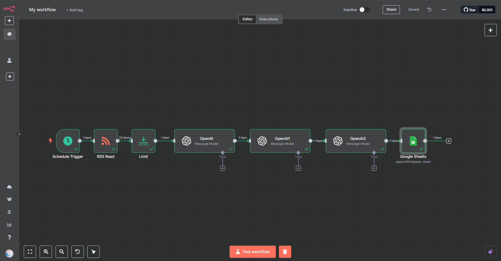
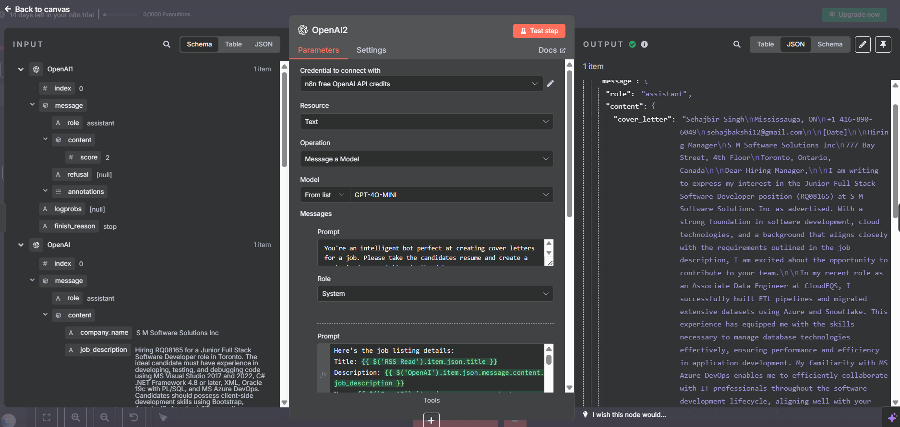
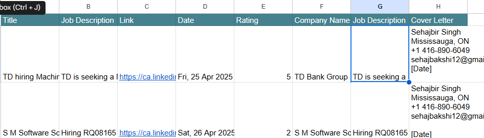

# n8n Automated Job Application Assistant

This project utilizes an n8n workflow to automate the process of finding relevant job postings, analyzing them against a resume, generating customized cover letters, and storing the results.

## Workflow Overview

The core idea is to streamline the initial steps of job application by:
1.  Fetching job listings from a predefined RSS feed.
2.  Using AI (OpenAI GPT-4o Mini) to parse job descriptions and extract key details.
3.  Evaluating the match between the job requirements and a predefined resume, generating a similarity score.
4.  Generating a tailored cover letter for each suitable job.
5.  Logging all gathered information and generated content into a Google Sheet for review and further action.

## Workflow Steps Breakdown

The n8n workflow consists of the following nodes connected sequentially:

1.  **Schedule Trigger:** Initiates the workflow automatically on a defined schedule (e.g., daily, hourly).
2.  **RSS Read:** Fetches the latest job postings from the specified RSS feed URL (`https://rss.app/feeds/jPqhPDQfNqj2JyGU.xml`).
3.  **Limit:** Restricts the number of job postings processed in a single run to manage workload and API usage.
4.  **OpenAI (Job Parsing):**
    *   Takes the raw job title and content from the RSS feed item.
    *   Uses GPT-4o Mini to extract structured data: `company_name`, `job_description` (summarized), and `location`.
5.  **OpenAI (Resume Matching):**
    *   Compares the extracted `job_description` against the hardcoded resume details within the node.
    *   Calculates a similarity `score` (out of 5) based on criteria like skills match, experience level, remote work preference, etc.
6.  **OpenAI (Cover Letter Generation):**
    *   Takes the job details (Title, Description, Company Name, Location) and the hardcoded resume.
    *   Generates a customized `cover_letter` tailored to the specific job posting.
    
7.  **Google Sheets:**
    *   Appends or updates a row in the target Google Sheet (`LinkedIn Jobs` spreadsheet, `Sheet1`).
    *   Stores the following information: Job Title, Link, Publication Date, Job Description, Company Name, Match Rating, and the generated Cover Letter.
    

## Technologies Used

*   **n8n:** Workflow automation platform.
*   **OpenAI API (GPT-4o Mini):** For natural language processing tasks (parsing, rating, generation).
*   **RSS:** To fetch job listings.
*   **Google Sheets:** As a database to store the results.

## Setup & Considerations

*   **Credentials:** Ensure n8n has valid credentials configured for OpenAI and Google Sheets.
*   **Resume:** The resume details are currently hardcoded within the OpenAI nodes. For flexibility, consider reading the resume from a file or variable.
*   **RSS Feed:** The specific RSS feed URL is hardcoded.
*   **Error Handling:** Add error handling branches in the n8n workflow to manage potential issues like API failures or data parsing errors.
*   **Customization:** Adjust the prompts used in the OpenAI nodes to fine-tune the parsing, rating, and cover letter generation according to specific needs.
*   **Workflow File:** The n8n workflow definition can be found in `My_workflow.json`.
